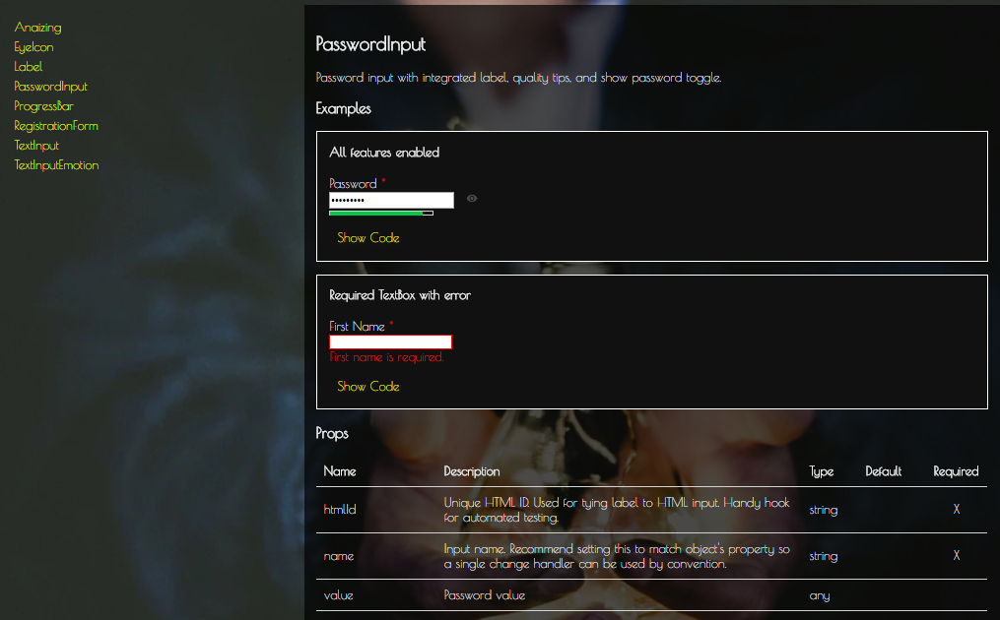
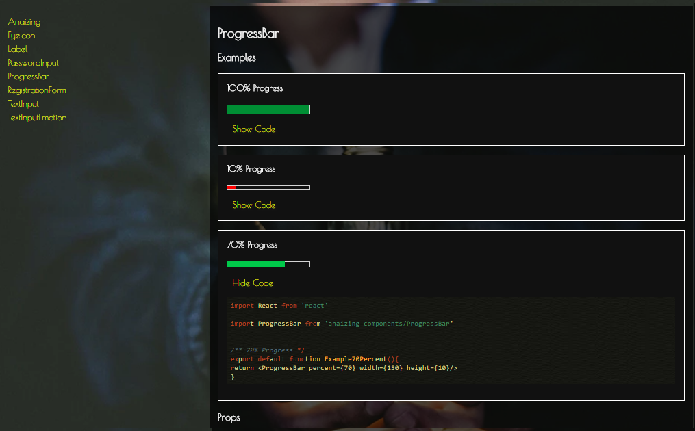

# anaizing-components

A library of React components that incorporates atomic design principles in composition.

## Install

```
npm install anaizing-components
```

## Docs
[Component Documentation](https://anaizing.github.io/anaizing-components/)

<br>

Click the link above to see the docs, complete with code examples, syntax highlighting and even the props each component takes so you can customise it. Enjoy!!!


<br>



<br>




This project was bootstrapped with [Create React App](https://github.com/facebookincubator/create-react-app).
